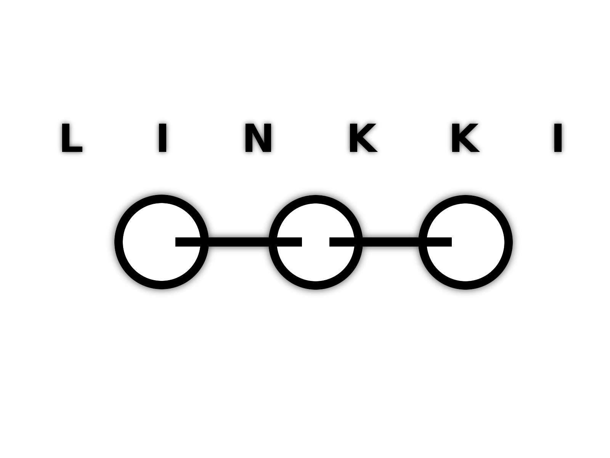

**Welcome to [University of Helsinki](http://helsinki.fi/university)'s massive open online course (MOOC) on object-oriented programming!** 

During this course you will learn all the basics of computer programming, algorithms and object-oriented programming using the Java programming language. The course includes comprehensive course materials and plenty of programming exercises, each tested using our automatic testing service [Test My Code](https://github.com/testmycode/tmc-server).

**Anyone can join - no previous programming knowledge is required.**

Unlike many programming courses found online, ours is completely unabridged: the course's scope and material are **identical to our own CS1** programming courses. This first part consists of 6 sets of tasks, corresponding to the 6 weeks of effort in the course taught at [our department](http://www.cs.helsinki.fi/en).

This is the first course in our computer science learning track and we use industry strength tools from day one. Therefore the course is about programming in a real integrated development environment (IDE) and not in the browser or an educational IDE. The page '[How to get started](registration-and-how-to-get-started.html)' will explain the details for setting up all necessary tools.

After you are finished, go to [part II]({{ "/programming-part-2/" | prepend: site.baseurl }}). 

# Schedule

- Week 1
	- User input
	- Printing on screen
	- Conditional statements
- Week 2
	- Loops
	- Basics of methods
- Week 3
	- Methods
	- ArrayList data structure
- Week 4
	- Basics of objects
- Week 5
	- More on objects
- Week 6
	- Tables
	- Sorting
	- Searching

# About the organizing institution

The [Department of Computer Science](http://www.cs.helsinki.fi/en) at the [University of Helsinki](http://www.helsinki.fi/university), has been chosen by the Finnish Higher Education Evaluation Council as a Centre of Excellence in Finnish University Education for 2007-2009 and 2010-2012. Teachers at the department have also been awarded the most prestiguous teacher awards (Magister Bonus prize in 2006 and 2011, and Eino Kaila prize in 2009). The latest turn in the long-term development of education at the department is the [RAGE (Agile education research)](http://www.cs.helsinki.fi/rage) research group, exploring and developing education with light and highly reactive educational structures, aiming to provide a massive increase in interaction between students and teachers.

The Linkki Centre organizes outreach activites in computer science under the Science Education Centre LUMA. Activities organized by the centre include clubs and camps organized for children and youth, coaching for comptetitive programming contests (such as the International Olympiad in Informatics) and courses for inservice teachers.

The MOOC courses are organized by the Department of Computer Science and the Linkki Centre operating at the department; the RAGE research group is responcible for teaching and course arrengements. The Technology Industries of Finland Centennial Foundation has funded some parts of the operation.

# Contact information

## Help with the exercises

- [IRC](irc-guide.html) (Internet Relay Chat)
	- Average response time 20 minutes
	- The official course staff are moderators and have an @ sign in front of their name.
	- Channel #mooc.fi @IRCnet
- [Google Groups](google-groups.html)
	-  Average response time 2 working days

## Technical issues and bugs

- Use our [ticket system](https://sourceforge.net/p/mooc-issues/tickets/) to report the issue

## Other business

- Send mail to mooc@cs.helsinki.fi
	- The email address is intended for administrative use only. For assistance with exercises see above.

